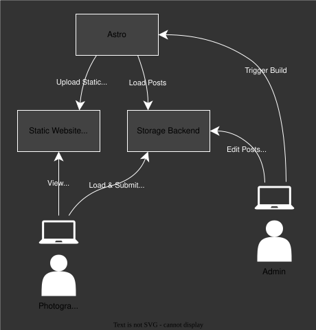

# Pascal Sommer Photography website

[My photography blog](https://photography.pascalsommer.ch), now rewritten in [Astro](https://astro.build/).

## Architecture Overview

The overall architecture of this website is split up into three components:

The website that visitors see is rendered almost entirely as static HTML. The only dynamic part is the comments section, which is rendered using React in the frontend. If the storage service happens to be unavailable, then the comments are temporarily not visible, and no new comments can be posted during that time, but otherwise the site remains functional.

The Storage Service is implemented in Laravel, using a MySQL database. The main reason for the choice of Laravel was that a previous version of this website was written in Laravel. That version already had a nice admin UI implemented, which made it possible to reuse that old version with almost no changes in this new setup.

While the Laravel version was fine as it was, I did sometimes run into downtimes where the database was unreachable, or the PHP server was not reliable, due to what I assume to be maintenance work by my webhost. This lead me to explore an architectore with zero server-logic.

This architecture is subject to change.
